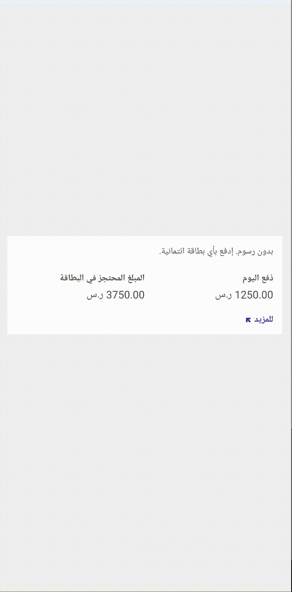
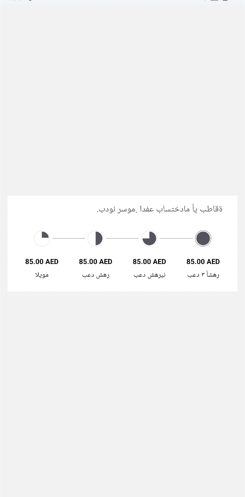

# Tabby checkout example app React Native 📱

Use [our SDK](https://www.npmjs.com/package/tabby-react-native-sdk) to integrate our snippets in your app.

## How to run the example app?

1. `npm i`
2. `cd ios && pod install`
3. `npm run start:rc`
4. Open XCode, let project to be indexed, run with "Play" button
5. set `android/local.properties` sdk path like sdk.dir=/Users/your_username/Library/Android/sdk
6. Open Android Studio, let project to sync, run with "Play" button
7. Define your `tabbyApiKey` as a constant and follow **Impelemtation** steps above

## Snippets usage

### TabbySplititSnippet

```typescript jsx
import React from "react";
import { TabbySplititSnippet } from "tabby-react-native-sdk";

<TabbySplititSnippet
  currency="SAR"
  price="5000.00"
  lang="en"
  containerStyle={{
    flex: 1
    // ...your other ViewStyle
  }}
  currencyTextStyle={{
    // ...your other TextStyle
  }}
  priceTextStyle={{
    // ...your other TextStyle
  }}
  textStyle={{
    // ...your other TextStyle
  }}
  splititTitleTextStyle={{
    // ...your other TextStyle
  }}
  learnMoreTextStyle={{
    // ...your other TextStyle
  }}
  url={
    // Your promo wiget url
  }
  withCurrencyInArabic={
    // Optional props. Set true if you need to display currency in Arabic.
  }
  arrowFill={
    // "#3835AF"
  }
/>
```

## Result




### TabbyLimitSnippet

```typescript jsx
import React from "react";
import { TabbyLimitSnippet } from "tabby-react-native-sdk";

<TabbyLimitSnippet
  lang={"en"}
  price={"5000"} // TabbyLimitSnippet will only be shown if the price is over 5000
  priceTextStyle={{
    fontSize: 12,
    fontFamily: "Cairo",
    // ...your other TextStyle
  }}
  currencyTextStyle={{
    fontSize: 12,
    fontFamily: "Cairo",
    // ...your other TextStyle
  }}
  textStyle={{
    fontSize: 12,
    fontFamily: "Cairo",
    // ...your other TextStyle
  }}
  containerStyle={{
    flex: 1
    // ...your other ViewStyle
  }}
  url={
    // Your promo wiget url
  }
  withCurrencyInArabic={
    // Optional props. Set true if you need to display currency in Arabic.
  }
/>
```

## Result


### TabbyCheckoutSnippet

```typescript jsx
import React from "react";
import { TabbyCheckoutSnippet } from "tabby-react-native-sdk";

<TabbyCheckoutSnippet
  lang={"en"}
  circleFillColor={['#3EEDBF', null, '#3EEDBF', null]}
  lineFillColor={['#3EEDBF', null, '#3EEDBF']}
  currency="AED"
  dateTextStyle={{
    fontSize: 12,
    fontFamily: "Cairo",
    // ...your other TextStyle
  }}
  price="340.00"
  priceTextStyle={{
    fontSize: 12,
    fontFamily: "Cairo",
    // ...your other TextStyle
  }}
  textStyle={{
    fontSize: 16,
    fontFamily: "Courier",
    // ...your other TextStyle
  }}
  containerStyle={{
    elevation: 3,
    shadowColor: '#000000',
    // ...your other ViewStyle
  }}
  withCurrencyInArabic={
    // Optional props. Set true if you need to display currency in Arabic.
  }
    />
```

## Result




### TabbyProductPageSnippet

```typescript jsx
import React from "react";
import { TabbyProductPageSnippet } from "tabby-react-native-sdk";

<TabbyProductPageSnippet
  lang={"ar"}
  currency="AED"
  price="340.00"
  maxLimit={"5000.00"} // Optional props. TabbyProductPageSnippet will be hidden if the maxLimit is less than price. 
  priceTextStyle={{
    fontSize: 12,
    fontFamily: "Cairo",
    // ...your other TextStyle
  }}
  currencyTextStyle={{
    fontSize: 14,
    fontFamily: "Inter",
    // ...your other TextStyle
  }}
  textStyle={{
    fontSize: 16,
    fontFamily: "Courier",
    // ...your other TextStyle
  }}
  containerStyle={{
    elevation: 3,
    shadowColor: "#000000",
    // ...your other ViewStyle
  }}
  url={
    // Your promo wiget url
  }
  withCurrencyInArabic={
    // Optional props. Set true if you need to display currency in Arabic.
  }
/>
```

## Result


### TabbyPaymentWebView

```typescript jsx
import React from "react";
import { TabbyPaymentWebView } from "tabby-react-native-sdk";

<TabbyPaymentWebView 
    onBack={
      // Your navigation back function
    }
    url={
      // Url from Tabby available product
    }
    onResult={
      // Your onResult function
    } 
  />
```